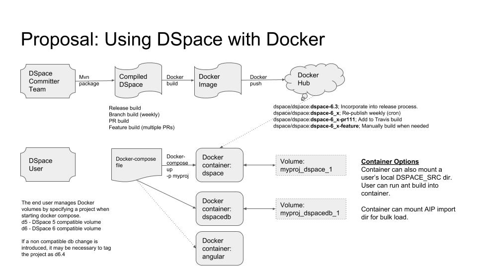

# DSpace-Docker-Images
Repository for developing and managing published Docker images (https://hub.docker.com/u/dspace/) for DSpace development

__This project is under development__

__Note: These images are intended for DSpace development purposes and are not appropriate for production use.__

## DSpace Docker Overview

## Tutorials

- [Running DSpace with Docker Compose](dspace-compose/README.md)
- [Building and Running DSpace with Docker Compose](dspace-dev-compose/README.md)
- [Manually deploying DSpace with Docker](tutorial.md)

## Images

| Image Name | Status | DockerHub | Labels | Compose Files | Comments |
| ---------- | ------ | --------- | ------ | ------------- | -------- |
| [dspace-postgres-pgcrypto](dspace-postgres-pgcrypto) | Published |  [dspace/dspace-postgres-pgcrypto](https://hub.docker.com/r/dspace/dspace-postgres-pgcrypto/) | latest | [dspace-compose](dspace-compose)   [dspace-dev-compose](dspace-dev-compose)  dspace-ingest-compose | Postgres image for DSpace 6+.  Also suitable for DSpace 5.|
| [dspace-tomcat](dspace-tomcat) | Published | [dspace/dspace-tomcat](https://hub.docker.com/r/dspace/dspace-tomcat/) | latest | [dspace-dev-compose](dspace-dev-compose) | Tomcat + Ant image configured for DSpace.  Requires an ant deploy to become usable (otherwise tomcat will start with no DSpace webapps).   User must mount DSPACE_SRC in order to deploy. |
| [dspace](dspace) | Not yet published || master  dspace-6_x  dspace-6.3 |[dspace-compose](dspace-compose)   dspace-ingest-compose | Tomcat + Ant with populated dspace-install directory.  DSpace code will be cloned and built during image build.  Image contains local.cfg and build.properties file suitable for the container. |
| dspace-angular | Not yet developed || | dspace7-compose | Containerized Angular UI |
| [dspace-angular-dev](dspace-angular-dev) | In progress ||| in project dir | Designed for Angular development, relies on an external REST API |
| dspace-oracle | Not yet developed ||| dspace-oracle-compose | For DSpace / Oracle testing |
| [dspace-codenvy-tomcat](dspace-codenvy-tomcat)|Published|[dspace-codenvy-tomcat](https://hub.docker.com/r/dspace/dspace-codenvy-tomcat/) |latest||Referenced by the Codenvy service|
| [dspace-janitor-angular](dspace-janitor-angular)|Developed|||Referenced by the Janitor Service|

## Compose files
| Compose File | Status | Purpose |
| ------------ | ------ | ------- |
| [dspace-dev-compose](dspace-dev-compose) |Developed|Runtime DSpace container.  User will manually deploy code into the container.|
| [dspace-compose](dspace-compose) | Developed | Running a pre-built DSpace Image for testing purposes|
| dspace-ingest-compose ||Compose file designed to assist a user with repository configuration and data ingest.|
| dspace7-compose||Compose file to run the DSpace 7 REST API and Angular UI|
| dspace-oracle-compose ||Compose file for testing DSpace code with Oracle|

## More information
For more information, join our [#dspace-docker Slack channel](https://dspace-org.slack.com/messages/C9YD42PV3).
