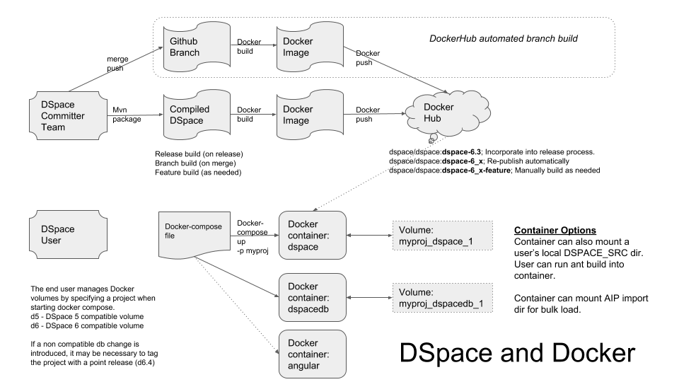

# DSpace-Docker-Images

This repository contains the source code for Docker Images for the [DSpace](https://dspace.org) project.
- [Docker](https://docs.docker.com/get-started/) simplifies the installation requirements for hosting an application by running an application image (_docker image_) within a containerized environment (_docker container_).
- [Docker Hub](https://dockerhub.com) is a registry of published application images.
- The DSpace project has published a set of [DSpace Images on DockerHub](https://hub.docker.com/u/dspace/) to simplify testing and development of the DSpace platform.
  - The project has automated the build of Docker Images for each of the supported branches of the DSpace code base ([build details](https://hub.docker.com/r/dspace/dspace/builds/)).
- A [Docker compose](https://docs.docker.com/compose/overview/) file is used to orchestrate the launch of interdependent containers.  
  - For DSpace 4, 5 and 6, those containers are the database and tomcat (xmlui, jspui)
  - For DSpace 7, the containers are the database, tomcat (for the REST api), and Node (running the Angular UI)
- The Docker compose file manages the allocation of _docker volumes_ which persist the contents of the DSpace database and the DSpace assetstore.

## Why Publish DSpace Images for Docker?
- To enable users (developers and repository mangagers) to easily test the latest code from each of the supported branches of DSpace
- To enable users (developers and repository mangagers) to easily test the code from each published release of DSpace
- To simplify the installation requirements for developers wishing to contribute code to the DSpace platform
- To simplify the management of multiple versions of DSpace (DSpace 5, 6, and 7) on a user's desktop
- To simplify the management of applicaiton dependencies for DSpace 7 (database, REST API, Angular UI) on a user's desktop
-  __Note: These images are intended for DSpace development purposes and are not appropriate for production use.__

## Tutorials

- [Setting Up Docker](documentation/tutorialSetup.md)
- [Running DSpace with Docker Compose](docker-compose-files/dspace-compose/README.md)
- [Running DSpace 7 (Angular Only) with Docker Compose](docker-compose-files/angular-compose/README.md)
  - [Testing DSpace 7 Angular Code with Docker Compose](docker-compose-files/angular-dev-compose/README.md)
- [Running DSpace + Oracle with Docker compose](docker-compose-files/dspace-oracle-compose/README.md)
- [Creating automated builds for your DSpace contributions](documentation/forkBuild.md)

---

## How is this Code Repository Organized?

## Published Images
This table lists the general purpose docker images supported by the DSpace project.  These images are intended to support the testing and development of DSpace from a user's desktop.

| Image Name | Status | DockerHub | Sample Labels | Comments |
| ---------- | ------ | --------- | ------------- | -------- |
| [dspace-postgres-pgcrypto](https://github.com/DSpace-Labs/DSpace-Docker-Images/tree/master/dockerfiles/dspace-postgres-pgcrypto) | Published |  [dspace/dspace-postgres-pgcrypto](https://hub.docker.com/r/dspace/dspace-postgres-pgcrypto/) | latest | Postgres image for DSpace 6+.  Also suitable for DSpace 5.|
| [dspace-postgres-4x](https://github.com/DSpace-Labs/DSpace-Docker-Images/tree/master/dockerfiles/dspace-postgres-4x) | Published |  [dspace/dspace-postgres-4x](https://hub.docker.com/r/dspace/dspace-postgres-4x/) | latest | Postgres image for DSpace 4x containing a pre-loaded DSpace 4x schema.|
| [dspace](https://github.com/DSpace/DSpace/blob/master/Dockerfile) | Published |[dspace/dspace](https://hub.docker.com/r/dspace/dspace/)| dspace-7_x-jdk8  dspace-6_x-jdk8  dspace-5_x-jdk7  [tag notes](https://wiki.duraspace.org/display/DSPACE/DSpace+and+Docker) | Tomcat + Ant with populated dspace-install directory.  DSpace code will be cloned and built during image build.  Image contains local.cfg or build.properties file suitable for the container. Image variants for "test" exist to make it easier to access all web services.|
| [dspace-angular](https://github.com/DSpace/dspace-angular/blob/docker/Dockerfile) | Published |[dspace/dspace-angular](https://hub.docker.com/r/dspace/dspace-angular/)| latest| Containerized Angular UI |
| [dspace-angular-bare](https://github.com/DSpace-Labs/DSpace-Docker-Images/tree/master/dockerfiles/dspace-angular-bare/) | Provisionally Published  |[dspace/dspace-angular-bare](https://hub.docker.com/r/dspace/dspace-angular-bare/)| latest|  Containerized Angular UI which allows you to mount a source directory_|

## Compose files
The following Docker Compose files can be used to simplify the management of DSpace components allowing a user to run an end-to-end DSpace instance from their desktop.

### Main DSpace Compose Files
[DSpace Compose Files](docker-compose-files/dspace-compose/ComposeFiles.md)

### Special Purpose Compose files

| Compose File | Host  | Image | Notes |
| ------------ | ----- | ----- | ----- |
| [angular-compose](https://github.com/DSpace-Labs/DSpace-Docker-Images/tree/master/docker-compose-files/angular-compose) | | | Compose file to run the DSpace 7 Angular UI with an External REST Service |
| [angular-dev-compose](https://github.com/DSpace-Labs/DSpace-Docker-Images/tree/master/docker-compose-files/angular-dev-compose) | | | Compose file to develop the DSpace 7 Angular UI with an External REST Service |
| | dspace-angular | dspace/dspace-angular-bare   | |
| [dspace-oracle-compose](https://github.com/DSpace-Labs/DSpace-Docker-Images/tree/master/docker-compose-files/dspace-oracle-compose) | | | Compose file for testing DSpace code with Oracle |
| | dspacedb | atmire/dspace-oracle            | |
| | dspace   | dspace/dspace                   | ||

---

## Special Purpose Images

### Published Images For Cloud Environments
This table lists DSpace Docker images that have been designed to  run in specific cloud environments.  An account for a specific cloud environment is necessary to utilize these images.

| Image Name | Status | DockerHub | Labels | Compose Files | Comments |
| ---------- | ------ | --------- | ------ | ------------- | -------- |
| [dspace-janitor-angular](https://github.com/DSpace-Labs/DSpace-Docker-Images/tree/master/dockerfiles/dspace-janitor-angular)|Developed||||Referenced by the [Janitor](https://janitor.technology) service|

### Development Images (Source Code Only)
This table lists docker images that have been optimized for DSpace software development.  These images may be more complex to utilize.  These images require a local build from source code.

| Image Name | Status | Compose Files | Comments |
| ---------- | ------ | ------------- | -------- |
| [dspace-angular-dev](https://github.com/DSpace-Labs/DSpace-Docker-Images/tree/master/dockerfiles/dspace-angular-dev) | In progress | in project dir | Designed for Angular development, relies on an external REST API |

## More information
For more information, join our [#dspace-docker Slack channel](https://dspace-org.slack.com/messages/C9YD42PV3).

[DSpace Docker Wiki Page](https://wiki.duraspace.org/display/DSPACE/DSpace+and+Docker)
