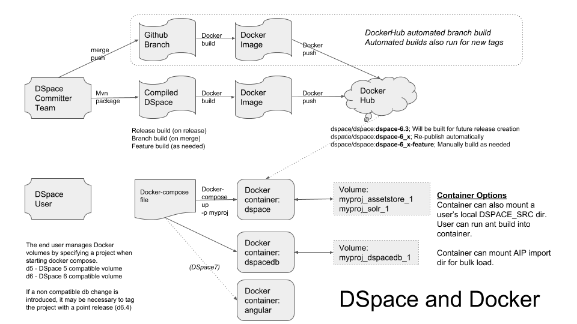

# DSpace-Docker-Images

This repository contains the source code for Docker Images for the [DSpace](https://dspace.org) project.
- [Docker](https://docs.docker.com/get-started/) simplifies the installation requirements for hosting an application by running an application image (_docker image_) within a containerized environment (_docker container_).
- [Docker Hub](https://dockerhub.com) is a registry of published application images.
- The DSpace project has published a set of [DSpace Images on DockerHub](https://hub.docker.com/u/dspace/) to simplify testing and development of the DSpace platform.
  - The project hopes to automate the build of Docker Images for each of the supported branches of the DSpace code base.
- A [Docker compose](https://docs.docker.com/compose/overview/) file is used to orchestrate the launch of interdependent containers.  
  - For DSpace 4, 5 and 6, those containers are the database and tomcat (xmlui, jspui)
  - For DSpace 7, the containers are the database, tomcat (for the REST api), and Node (running the Angular UI)
- The Docker compose file manages the allocation of _docker volumes_ which persist the contents of the DSpace database and the DSpace assetstore.

## Why Publish DSpace Images for Docker?
- To enable users (developers and repository mangagers) to easily test the latest code from each of the supported branches of DSpace
- To enable users (developers and repository mangagers) to easily test the code from each published release of DSpace
- To simplify the installation requirements for developers wishing to contribute code to the DSpace platform
- To simplify the management of multiple versions of DSpace (DSpace 5, 6, and 7) on a user's desktop
- To simplify the management of applicaiton dependencies for DSpace 7 (database, REST API, Angular UI) on a user's desktop
-  __Note: These images are intended for DSpace development purposes and are not appropriate for production use.__

## Tutorials
The following tutorials have been designed to help DSpace users to understand how to work with Docker and how to work with the images that have been publiehsed for DSpace.

- [Running DSpace with Docker Compose](docker-compose-files/dspace-compose/README.md)
- [Running DSpace 7 (Angular+REST) with Docker Compose](docker-compose-files/dspace7-compose/README.md)
- [Running DSpace 7 (Angular Only) with Docker Compose](docker-compose-files/dspace-angular/README.md)
- [Building and Running DSpace with Docker Compose](docker-compose-files/dspace-dev-compose/README.md)
- [Ingesting Content into a Docker Container](docker-compose-files/dspace-ingest-compose/README.md)
- [Manually deploying DSpace with Docker](documentation/tutorial.md)

---

## How is this Code Repository Organized?
The following overview diagram describes how the Dockerfiles and Docker Compose files in this repository relate to each other.

---

## Published Images
This table lists the general purpose docker images supported by the DSpace project.  These images are intended to support the testing and development of DSpace from a user's desktop.

| Image Name | Status | DockerHub | Sample Labels | Compose Files | Comments |
| ---------- | ------ | --------- | ------------- | ------------- | -------- |
| [dspace-postgres-pgcrypto](dockerfiles/dspace-postgres-pgcrypto) | Published |  [dspace/dspace-postgres-pgcrypto](https://hub.docker.com/r/dspace/dspace-postgres-pgcrypto/) | latest | dspace-compose   dspace7-compose   dspace-dev-compose  dspace-ingest-compose | Postgres image for DSpace 6+.  Also suitable for DSpace 4 and 5.|
| [dspace-tomcat](dockerfiles/dspace-tomcat) | Published | [dspace/dspace-tomcat](https://hub.docker.com/r/dspace/dspace-tomcat/) | latest |  | Used for manual deployment of DSpace. Tomcat + Ant image configured for DSpace.  Requires an ant deploy to become usable (otherwise tomcat will start with no DSpace webapps).   User must mount DSPACE_SRC in order to deploy. |
| [dspace](dockerfiles/dspace) | Published |[dspace/dspace](https://hub.docker.com/r/dspace/dspace/)| master  dspace-6_x  dspace-6.3 |dspace-compose   dspace7-compose   dspace-ingest-compose   dspace-dev-compose| Tomcat + Ant with populated dspace-install directory.  DSpace code will be cloned and built during image build.  Image contains local.cfg and build.properties file suitable for the container. |
| [dspace-angular-dev](dockerfiles/dspace-angular-dev) | In progress ||| in project dir | Designed for Angular development, relies on an external REST API |
| [dspace-angular](dockerfiles/dspace-angular) | Published |[dspace/dspace-angular](https://hub.docker.com/r/dspace/dspace-angular/)| latest| dspace7-compose  angular-compose | Containerized Angular UI |
| dspace-oracle | Not yet developed ||| dspace-oracle-compose | For DSpace / Oracle testing |

## DSpace Docker Compose files
The following Docker Compose files can be used to simplify the management of DSpace components allowing a user to run an end-to-end DSpace instance from their desktop.

| Compose File | Status | Purpose |
| ------------ | ------ | ------- |
| [dspace-dev-compose](docker-compose-files/dspace-dev-compose) | Developed | Runtime DSpace container.  User will manually deploy code into the container. |
| [dspace-compose](docker-compose-files/dspace-compose) | Developed | Running a pre-built DSpace Image for testing purposes |
| [dspace-ingest-compose](docker-compose-files/dspace-ingest-compose) | Developed |Compose file designed to assist a user with repository configuration and data ingest. |
| dspace7-compose | To be created | Compose file to run the DSpace 7 REST API and Angular UI |
| dspace-oracle-compose | To be created| Compose file for testing DSpace code with Oracle |

---

## Special Purpose Images

### Published Images For Cloud Environments
This table lists DSpace Docker images that have been designed to  run in specific cloud environments.  An account for a specific cloud environment is necessary to utilize these images.

| Image Name | Status | DockerHub | Labels | Compose Files | Comments |
| ---------- | ------ | --------- | ------ | ------------- | -------- |
| [dspace-codenvy-tomcat](dockerfiles/dspace-codenvy-tomcat) |Published|[dspace-codenvy-tomcat](https://hub.docker.com/r/dspace/dspace-codenvy-tomcat/) |latest||Referenced by the [Codenvy service](https://codenvy.io)|
| [dspace-janitor-angular](dockerfiles/dspace-janitor-angular)|Developed||||Referenced by the [Janitor](https://janitor.technology) service|

### Development Images (Source Code Only)
This table lists docker images that have been optimized for DSpace software development.  These images may be more complex to utilize.  These images require a local build from source code.

| Image Name | Status | Compose Files | Comments |
| ---------- | ------ | ------------- | -------- |
| [dspace-angular-dev](dockerfiles/dspace-angular-dev) | In progress | in project dir | Designed for Angular development, relies on an external REST API |

## More information
For more information, join our [#dspace-docker Slack channel](https://dspace-org.slack.com/messages/C9YD42PV3).

[DSpace Docker Wiki Page](https://wiki.duraspace.org/display/DSPACE/DSpace+and+Docker)
