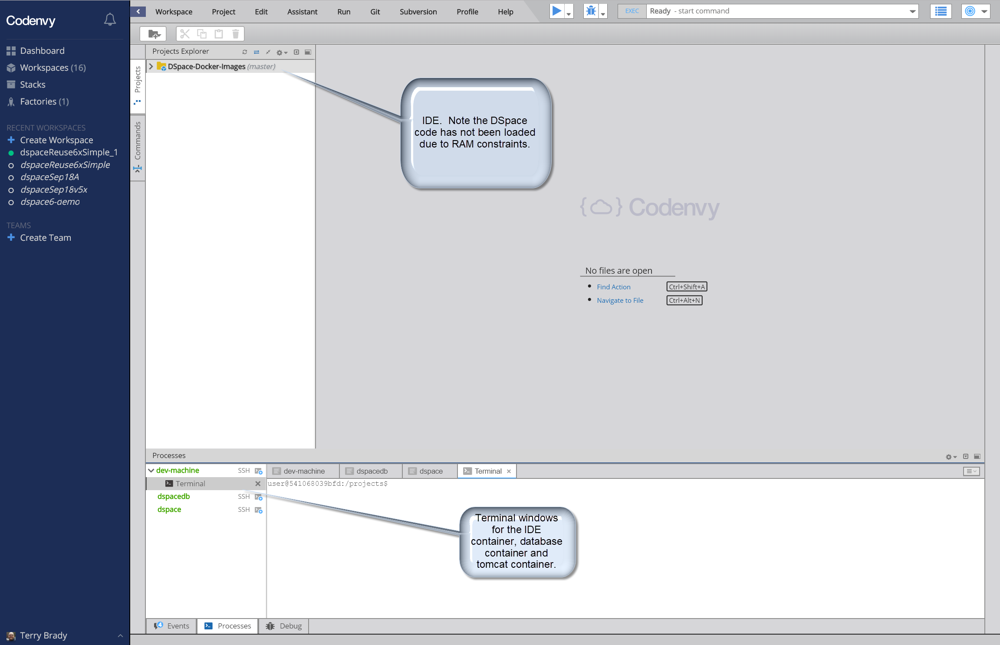
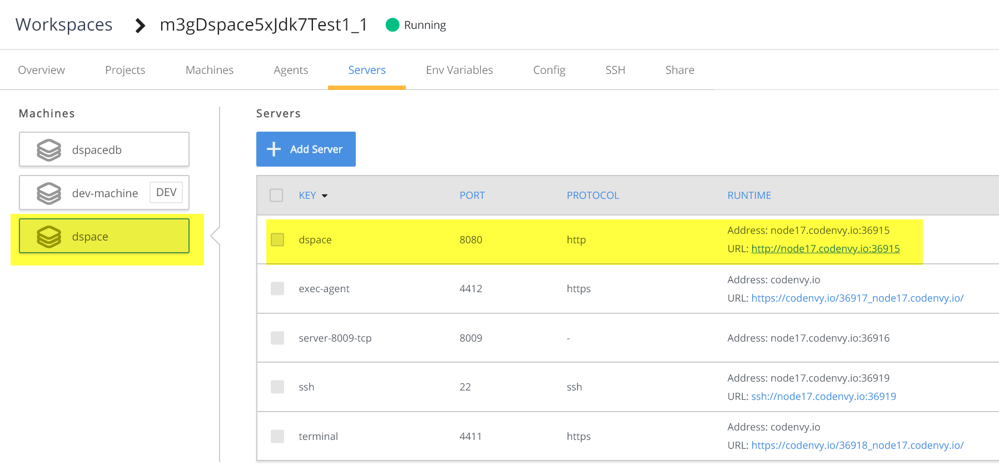

# Using Published DSpace Images in Codenvy
The [Codenvy Service](https://codenvy.com/) provides a cloud-hosted instance of the Eclipse Che editor and and a cloud hosted service for running Docker containers.

The service has many compelling features and some limitations.  Customer support is non-existent even for paid accounts.

## Codenvy RAM Usage
Codenvy provides a free tier account that uses up to 3G of RAM.

This is sufficient to run a small DSpace instance.

The Codenvy IDE (Che) requires at least 3G of RAM to manage the full DSpace Code base.  Therefore, it is impossible to manage code and run DSpace in a free tier workspace.

| Image | Free Tier RAM | Recommended RAM w paid account |
| - | - | - |
| dev-machine | .5G | 3G |
| dspace (tomcat) | 2G | 2.5G |
| dspacedb (postgres) | .5G | .5G |

## Try out Codenvy Using this Pre-Built Factory
The following [link](https://codenvy.io/dashboard/#/load-factory/factorycv7vosz66cgk1ly3) to a Codenvy factory will build a 3GB workspace running the latest DSpace 5x published Docker Image.

After the server starts, you will see a URL for the tomcat service.  (Codenvy is fussy about reloading this information, so you may need to navigate away from the page to force a refresh.)

Note about the dspace/tomcat container
The tomcat instance (container named dspace) cannot be stopped or restarted.  If you wish to reload a webapp, you should modify the webapp web.xml file in `/dspace/webapps/*/WEB-INF/web.xml`

## Ingest Scripts in codenvy

Each Codenvy container in a workspace shares an SSH key.  You can expose this key by clicking the "SSH" button next to the server.

The following process will allow you to install DSpace ingest tools into the tomcat container.

In the dev-machine container, save the text of the ssh key to `~/.ssh/id_rsa`

    chmod 400 ~/.ssh/id_rsa
    chmod 744 /projects/DSpace-Docker-Images/add-ons/codenvy-scripts/setupCondenvy.sh
    /projects/DSpace-Docker-Images/add-ons/codenvy-scripts/setupCondenvy.sh

In the dspace (tomcat) container

    cd /ingest-tools
    chmod 744 *.sh
    createAdmin.sh
    getAIP.sh
    ingestAIP.sh

Open the xmlui web service to view the content that has been added to DSpace.

## Understanding the Codenvy configurations

### Docker Compose to port to Codenvy

Here is the docker-compose file that will be replicated on Codenvy.  Codenvy only supports a subset of Docker Compose functionality.

    services:
      dspacedb:
        image: dspace/dspace-postgres-pgcrypto
        volumes:
          - pgdata:/pgdata

      dspace:
        image: "dspace/dspace:dspace-5_x-jdk7-test"
        ports:
          - 8080:8080
        volumes:
          - "assetstore:/dspace/assetstore"
          - "solr:/dspace/solr"
        depends_on:
          - dspacedb

### Codenvy Stack

In Codenvy workspace configuration, a "dev-machine" must be defined in order to present the IDE and Workspace.

In Codenvy, this information will be stored as a "Codenvy Stack".

    "recipe": {
      "type": "compose",
      "content": "services:\n dev-machine:\n  image: eclipse/ubuntu_jdk8\n dspacedb:\n  image: dspace/dspace-postgres-pgcrypto\n  mem_limit: 536870912\n dspace:\n  image: 'dspace/dspace:dspace-5_x-jdk7-test'\n  mem_limit: 2147483648\n",
      "contentType": "application/x-yaml"
    }

### Codenvy workspace

Within the Codenvy workspace, container ports can be exposed to the internet.  After the workspace has started, this port will be assigned a public DNS and port.

    "dspace": {
      "attributes": {
        "memoryLimitBytes": "2147483648"
      },
      "servers": {
        "dspace": {
          "port": "8080",
          "properties": {},
          "protocol": "http"
        }
      },
      "agents": [
        "org.eclipse.che.ssh",
        "org.eclipse.che.terminal",
        "org.eclipse.che.exec"
      ]
    },

Next, a Codenvy Workspace is defined to use this Stack.  A Codenvy Workspace can also have a project associated with it.  The "DSpace-Labs/DSpace-Docker-Images" project has been added.

    "projects": [
       {
         "links": [],
         "name": "DSpace-Docker-Images",
         "attributes": {
           "contribute_to_branch": [
             "master"
           ]
         },
         "type": "blank",
         "source": {
           "location": "https://github.com/DSpace-Labs/DSpace-Docker-Images",
           "type": "git",
           "parameters": {}
         },
         "path": "/DSpace-Docker-Images",
         "description": "",
         "problems": [],
         "mixins": [
           "pullrequest"
         ]
       }
     ],
     "name": "m3gDspace5xJdk7Test1_1",

After testing and verifying this workspace, a Codenvy Factory can be created from the workspace to provide one-click sharing of the environment with other users.
