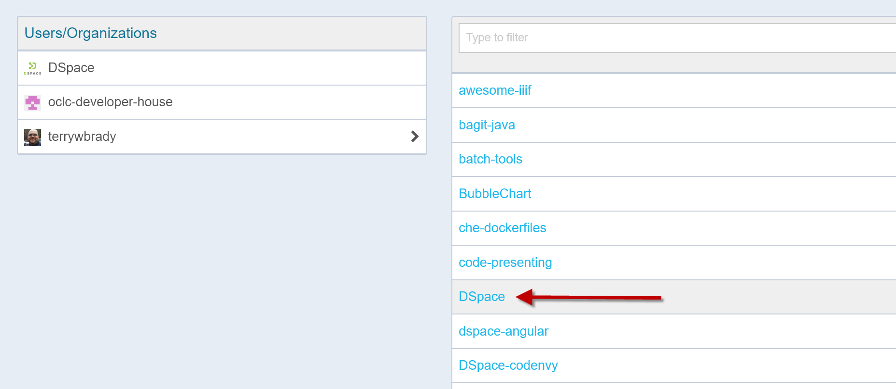
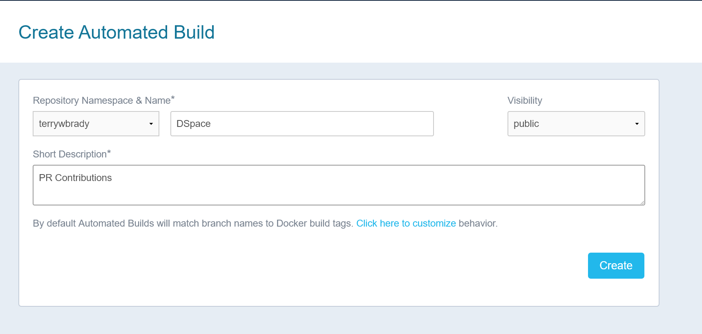
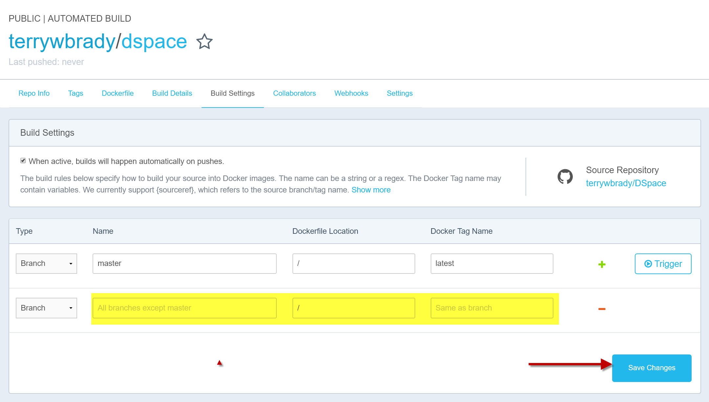
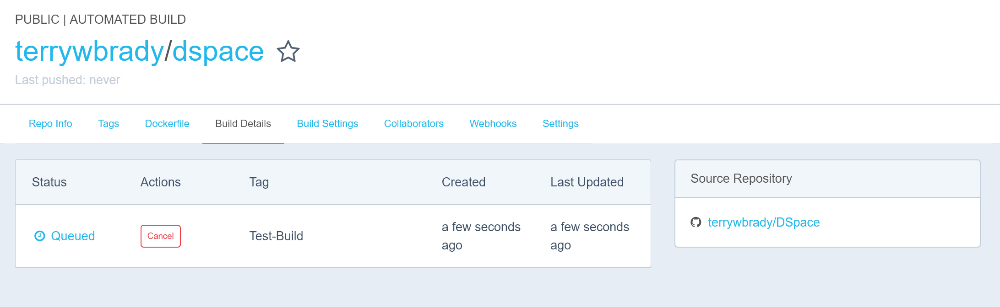

## Automated Builds for Your DSpace Contributions

If you are a frequent contributor to DSpace, you can automate the build of Docker images for your contribution branches. 
This will enable other DSpace developers to quickly review and test your changes.

## Create an Automated Build

#### Sign into DockerHub with your account

#### From the menu, choose "Create -> Create Automated Build"

#### Click "Create Auto-build Github"
Carefully review the permissions that have been requested and grant access if you are comfortable.

#### Select your DSpace fork

#### On the "Create Automated Build" screen
Keep the repository name of "DSpace".
For the "Short Description" enter "PR Contributions".
Click "Create"

#### Go to Build Settings
Create a rule to generate a build for all new branches.

Note, with an unpaid account on DockerHub, builds will queue up. You can choose to trigger builds manually rather than automatically.

#### Push a new branch named "Test-Build" to your repo  

#### Go to Build Details
Note the status of the builds that are running.  You should see a build for branch "Test-Build".

