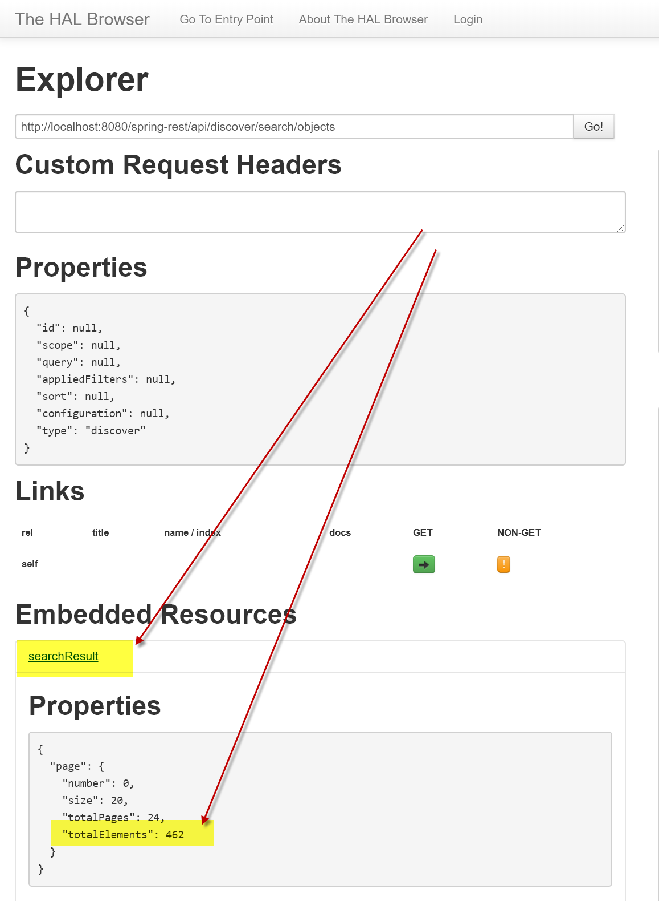


## Running DSpace 7 With Entities

Our recommended Docker installation instructions are [here](https://dspace-labs.github.io/DSpace-Docker-Images/documentation/tutorialSetup.html).  Be sure to configure Docker with at least 6G of RAM when running this test.

A test dataset exists to illustrate the functionality of **DSpace Configurable Entities** .

An optional docker compose file exists to trigger the population of new DSpace containers with this content.

### Go to the Docker Compose Directory
```shell
cd
cd DSpace-Docker-Images/docker-compose-files/dspace-compose
```

### Ingest the Entities Test Dataset and Start DSpace 7 (localhost setup)

_These instructions describe how to run DSpace in Docker on your local PC, Mac or Linux desktop.
This is the most common deployment option.  This option is suitable for personal testing of DSpace._

To run the __DSpace 7 Preview Release__ images.
```shell
docker-compose -p d7 -f docker-compose.yml -f d7.override.yml -f d7.preview.yml -f load.entities.yml pull
docker-compose -p d7 -f docker-compose.yml -f d7.override.yml -f d7.preview.yml -f load.entities.yml up -d
```

To run the __latest DSpace 7__ images.
```shell
docker-compose -p d7 -f docker-compose.yml -f d7.override.yml -f load.entities.yml pull
docker-compose -p d7 -f docker-compose.yml -f d7.override.yml -f load.entities.yml up -d
```

Verify that DSpace is Running
```shell
docker ps
```
It will take approximately 5 minutes for the services to start completely.  Once they have started, you can view them on the web.

- [http://localhost:8080/spring-rest](http://localhost:8080/spring-rest)
- [http://localhost:3000](http://localhost:3000)

### Ingest the Entities Test Dataset and Start DSpace 7 (Server Setup)

_These instructions describe how to run DSpace in Docker on a remote server or cloud server.
This option is most suitable for sharing a DSpace instance with your colleagues._


Edit [Angular environment.dev.js](../add-ons/angular-tools/environment.dev.js) on your server.  
Replace __locahost__ with your server's hostname.

To run the __DSpace 7 Preview Release__ images.
```shell
export BASEROOT=http://<server-dns>:8080
docker-compose -p d7 -f docker-compose.yml -f d7.override.yml -f d7.preview.yml -f load.entities.yml pull
docker-compose -p d7 -f docker-compose.yml -f d7.override.yml -f d7.preview.yml -f load.entities.yml up -d
```

To run the __latest DSpace 7__ images.
```shell
export BASEROOT=http://<server-dns>:8080
docker-compose -p d7 -f docker-compose.yml -f d7.override.yml -f load.entities.yml pull
docker-compose -p d7 -f docker-compose.yml -f d7.override.yml -f load.entities.yml up -d
```

#### To stop the services

```
docker-compose -p d7ent -f docker-compose.yml -f d7.override.yml -f d7.preview.yml -f load.entities.yml down
```

Verify that DSpace has stopped
```shell
docker ps
```

#### On subsequent restart, you do not need the load.entities.yml file

To run the __DSpace 7 Preview Release__ images.
```
docker-compose -p d7ent -f docker-compose.yml -f d7.override.yml -f d7.preview.yml up -d
```

To run the __latest DSpace 7__ images.
```
docker-compose -p d7ent -f docker-compose.yml -f d7.override.yml up -d
```

### Testing the entities functionality

#### Test User credentials

| e-mail | password |
| ------ | -------- |
| dspacedemo+submit@gmail.com | dspace |
| dspacedemo+admin@gmail.com | dspace |
| dspacedemo+acceptreject@gmail.com | dspace |
| dspacedemo+acceptrejectedit@gmail.com | dspace |
| dspacedemo+edit@gmail.com | dspace |

#### Note about indexing

After the applications have started, discovery reindexing will start. This will require approximately 5 minutes as well. You can view the status [here](http://localhost:8080/spring-rest/#http://localhost:8080/spring-rest/api/discover/search/objects). Once complete, the index should contain 462 totalElements.



#### Collections of interest

- [Journal Example](http://localhost:3000/items/a23eae5a-7857-4ef9-8e52-989436ad2955) represents a journal with journal volumes, issues and articles, as detailed in [the Configurable Entities Design](https://docs.google.com/document/d/1X0XsppZYOtPtbmq7yXwmu7FbMAfLxxOCONbw0_rl7jY/edit#heading=h.p5ja9m7zrpks).
- [Publications Example](http://localhost:3000/collections/dd1240ae-d7dd-405c-bdc3-d6c960609433) contains publications which contain a combination of plain-text authors and related author entities. It also contains relations to Research Projects and Organizational Units, as detailed in [the Configurable Entities design](https://docs.google.com/document/d/1X0XsppZYOtPtbmq7yXwmu7FbMAfLxxOCONbw0_rl7jY/edit#heading=h.x0m096abh8pu). Navigating to e.g. a Person will reveal their relations to Publications, Research Projects and Organizational Units.
- The submission can be verified in one of the collections in [this community](http://localhost:3000/communities/c0e4de93-f506-4990-a840-d406f6f2ada7) where the workflow is enabled. You can use the accounts mentioned above to perform the submission and workflow steps. The admin account can perform the submission and all workflow steps as well.

### Next steps

See [Common Tasks](run.CommonTasks.md) for additional actions you can take with your DSpace instance.

### Delete docker Volumes
_This will allow you to build a fresh installation with new data._

```shell
docker volume rm d7_assetstore d7_pgdata d7_solr_authority d7_solr_oai d7_solr_search d7_solr_statistics
```
