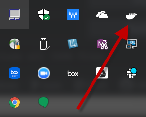
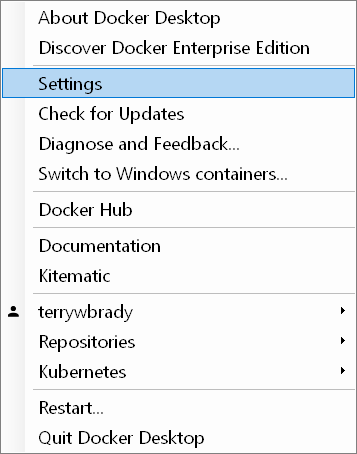
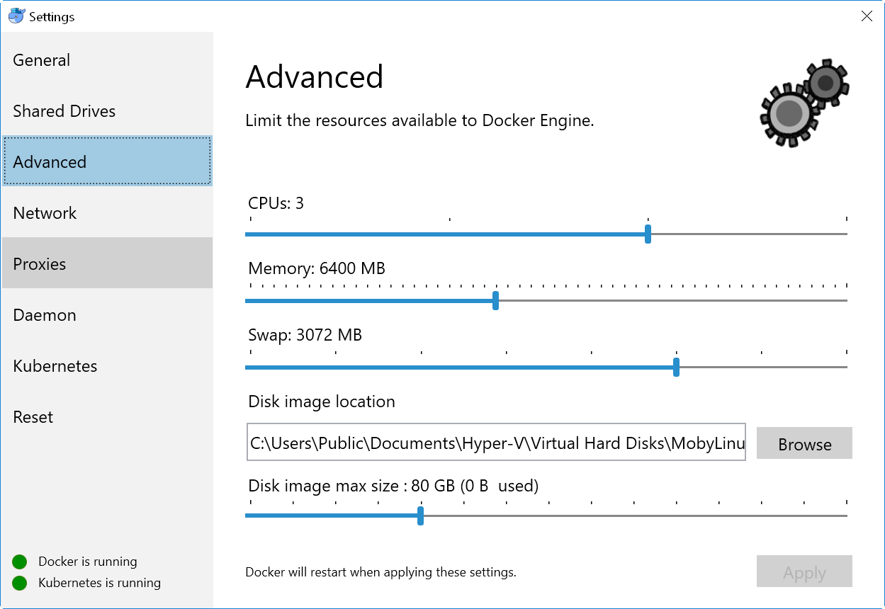
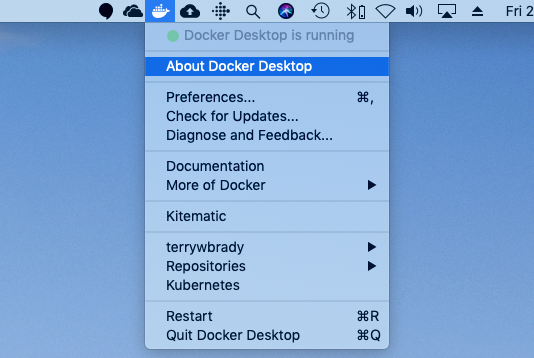
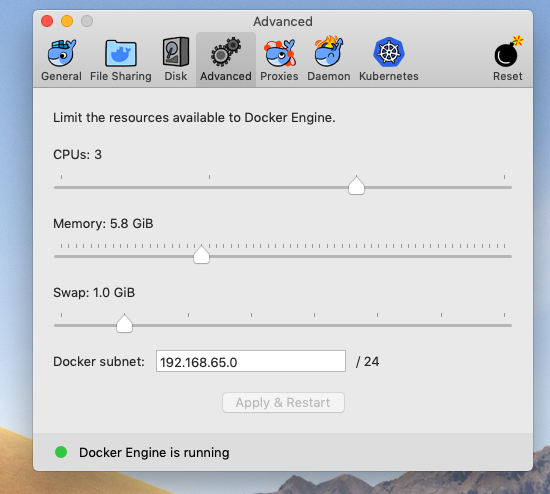


## Allocate Memory for Docker DSpace

_Note: DSpace Docker requires a minimum of 5-6G of RAM allocated to Docker in order to run._  

Run the following command to verify your memory allocation for Docker.

`docker info | grep Memory`

If less that 5G has been allocated to Docker, you can increase this value in the Docker Control Panel.

### Windows 10

Select Docker in the System Tray

Select Settings from the Docker Menu

Adjust the RAM allocation
_Assuming you have sufficient memory available on your desktop_

### MacOS

Select the Docker Icon

Adjust the RAM allocation on the Advanced Tab
_Assuming you have sufficient memory available on your desktop_

