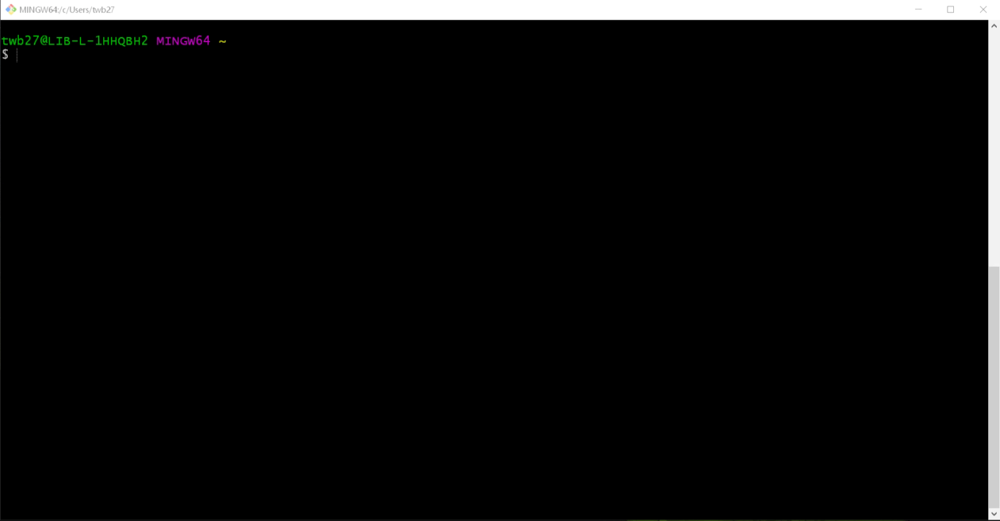

## Windows 10 setup for Docker DSpace

### Install Docker Desktop

https://dspace-labs.github.io/DSpace-Docker-Images/documentation/tutorialSetup.html

### Install Git Bash as a terminal for running Docker
_This shell most closely mirrors the user experience for MacOS and Linux users_

https://git-scm.com/downloads

Run the following command to verify your install
```shell
  git version
```

### Download DSpace Docker Compose Files

```shell
cd
git clone https://github.com/DSpace-Labs/DSpace-Docker-Images.git
cd DSpace-Docker-Images/docker-compose-files/dspace-compose
```



### Note for Windows users running docker commands

- When running a DSpace command that requires terminal interaction, prefix your docker command with `winpty`
- When referencing a directory with a docker container, use `//` instead of `/`.  Example `//dspace`

### Next Steps

- [Run DSpace 6](run.DSpace6.md)
- [Run DSpace 7](run.DSpace7.md)
