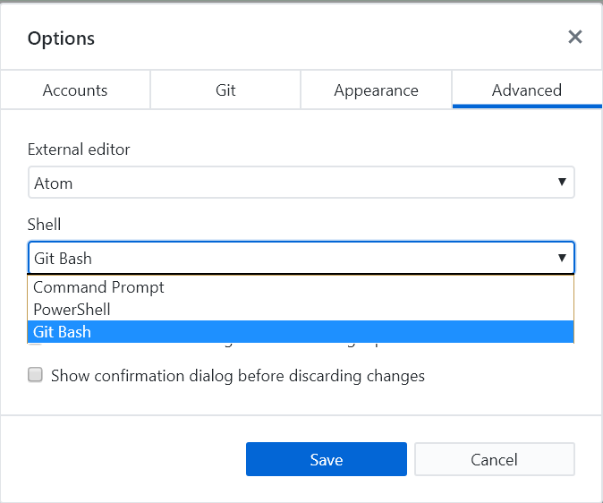

# Setting Up DSpace on Docker

## Install Docker
- [Docker Install](https://docs.docker.com/install/)

## If you are running Docker for Windows
_You must manage your line endings for files that will be deployed to Docker_

TODO: should this config setting be localized to just the DSpace Repo?

```
git config --global core.autocrlf false
git config --global core.eol lf
```

### GitHub for windows
In GitHub for Windows, you can set your default shell to "Git Bash".




### Shell Variations
If you are running Docker from Windows, some actions will vary based on the shell that you are using.

#### Referencing Container Paths
The following command will list the root diretory for a container.

#### Bash
```
docker run -it --rm ubuntu ls /
```

#### Git-Bash Windows

The Git Bash Shell attempts to convert a starting slash to a windows host directory.  Use a double slash if you are running in Git Bash.  If you expect to see command line output from a docker command, prefix the command with `winpty`/

```
winpty docker run -it --rm ubuntu ls //
```

#### Setting Environment Variables
This tutorial will focus on the syntax for Bash on Linux/MacOS and Git-Bash on Windows 10.

It is possible to run docker using an alternative shell.  Some commands will require a variation in the syntax if you are using an alternate shell.

Set FOO to BAR
- MacOS or bash: `export FOO=BAR`
- Windows CMD: `set FOO=BAR`
- Windows Powershell: ???

Set DSPACE_SRC to current directory
- MacOS or bash: `export DSPACE_SRC=$(pwd)`
- Windows CMD: `set DSPACE_SRC=%cd%`
- Windows Powershell: ???

## Create local.cfg for the Docker image in the DSpace root directory
_This file is already in the .gitignore file, it is intended to be localized_

- dspace.dir=/dspace
- db.url = jdbc:postgresql://dspacedb:5432/dspace
- dspace.hostname = dspacetomcat
- dspace.baseUrl = http://dspacetomcat:8080

If you are building DSpace 4 or5, these changes must be made in the build.properties file
