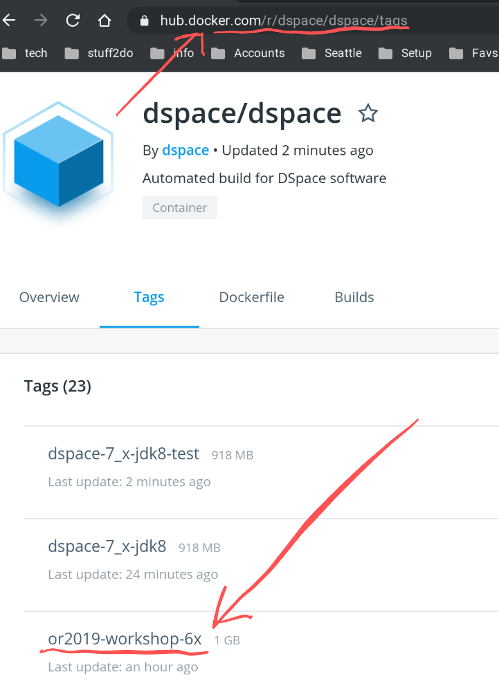


# Exercise 3B: Running DSpace 6 with Docker-Compose

### Start DSpace 6

```shell
docker-compose -p d6 -f docker-compose.yml -f d6.override.yml pull
docker-compose -p d6 -f docker-compose.yml -f d6.override.yml up -d
```

Verify that DSpace is Running
```shell
docker ps
```

It will take 2-5 minutes for the services to start completely.  Once they have started, you can view them on the web.
The first time you start DSpace, it will load some default AIP content.  This process takes an additional 3-5 minutes.
- [http://localhost:8080/xmlui](http://localhost:8080/xmlui)

### Run command line tasks (create admin, create user)

Create a new administrator account.  Make up a fake administrator account.

MacOS/Linux
```shell
docker exec -it dspace /dspace/bin/dspace create-administrator
```

Windows
```shell
winpty docker exec -it dspace //dspace/bin/dspace create-administrator
```

Open [XMLUI](http://localhost:8080/xmlui) and verify that you are able to login with the admin account that you just created.

### Run DSpace 6 with a modified (published image)

Shutdown your running copy of DSpace
```shell
docker-compose -p d6 -f docker-compose.yml -f d6.override.yml down
```

For this test, we are going to use a tagged version of the DSpace image.  
- Open [https://hub.docker.com/r/dspace/dspace/tags](https://hub.docker.com/r/dspace/dspace/tags) to explore the available images
  - Look for __or2019-workshop-6x__
  - [Pull Request Used to Create This Image](https://github.com/DSpace/DSpace/pull/2431/files)



Set the variable DSPACE_VER to select a different image.

```shell
DSPACE_VER=or2019-workshop-6x docker-compose -p d6 -f docker-compose.yml -f d6.override.yml config | grep image:
```

Run the following commands to start DSpace with this image.

```shell
DSPACE_VER=or2019-workshop-6x docker-compose -p d6 -f docker-compose.yml -f d6.override.yml pull
DSPACE_VER=or2019-workshop-6x docker-compose -p d6 -f docker-compose.yml -f d6.override.yml up -d
```

Open [XMLUI](http://localhost:8080/xmlui) and notice the change to the welcome page.  You might need to clear your cache to force the background color change to load.

### Verify DSpace Configuration Values

There is a command line tool that allows you to verify DSpace configuration properties.  This can be called inside your container using the following command.

Print Config Value - MacOS/Linux
```shell
docker exec -it dspace /dspace/bin/dspace dsprop -p dspace.name
docker exec -it dspace /dspace/bin/dspace dsprop -p dspace.url
```

Print Config Value - Windows
```shell
winpty docker exec -it dspace //dspace/bin/dspace dsprop -p dspace.name
winpty docker exec -it dspace //dspace/bin/dspace dsprop -p dspace.url
```

### Pass params via compose

Browse the Dog Photos Collection.  Note that thumbnail images __do not__ appear beside the list of items.

Print Config Value - MacOS/Linux
```shell
docker exec -it dspace /dspace/bin/dspace dsprop -p xmlui.theme.mirage.item-list.emphasis
```

Print Config Value - Windows
```shell
winpty docker exec -it dspace //dspace/bin/dspace dsprop -p xmlui.theme.mirage.item-list.emphasis
```

The output will be blank.

```shell
docker-compose -p d6 -f docker-compose.yml -f d6.override.yml down
```

Create local.override.yml

_Note that periods and dashes are replaced with special characters_
```
# suitable for DSpace 6 and 7
version: "3.7"

services:
  dspace:
    environment:
      # __D__ -> -
      # __P__ -> .
      - xmlui__P__theme__P__mirage__P__item__D__list__P__emphasis=file
```

```shell
docker-compose -p d6 -f docker-compose.yml -f d6.override.yml -f local.override.yml up -d
```

Verify the change in the property value (see above)

Browse the Dog Photos Collection.  Note that thumbnail images __do appear__ beside the list of items.

### Pass in files via docker-compose
Within a Docker Compose file, you can override files within your docker containers.

In [../../docker-compose-files/dspace-compose/d6.override.yml](../../docker-compose-files/dspace-compose/d6.override.yml) comment out the line as follows.
```
      - "../../add-ons/mirage2/xmlui.xconf:/dspace/config/xmlui.xconf"
```

Insert a # as follows
```
      # - "../../add-ons/mirage2/xmlui.xconf:/dspace/config/xmlui.xconf"
```

Look for the following line in [../../add-ons/mirage2/xmlui.xconf](../../add-ons/mirage2/xmlui.xconf).  This sets the theme to "Mirage2"
```
<theme name="Atmire Mirage Theme" regex=".*" path="Mirage2/" />
```

Stop and restart DSpace.  Open XMLUI and note the change in the appearance of the site.

```shell
docker-compose -p d6 -f docker-compose.yml -f d6.override.yml down
docker-compose -p d6 -f docker-compose.yml -f d6.override.yml up -d
```


### Volume management

Docker will can save your content to a __docker volume__.

Run the following command to display your volumes.

```
docker volume ls
```

Stop DSpace and run the following command to wipe out your database volume.

```
docker-compose -p d6 -f docker-compose.yml -f d6.override.yml down
docker volume rm d6_pgdata
```

Restart DSpace.  

```shell
docker-compose -p d6 -f docker-compose.yml -f d6.override.yml up -d
```
Open XMLUI and note that no items exist in your database.

Stop DSpace and delete all of your docker volumes with the following command.

```
docker-compose -p d6 -f docker-compose.yml -f d6.override.yml down
docker volume rm d6_pgdata d6_assetstore d6_solr_authority d6_solr_oai d6_solr_search d6_solr_statistics
```

Restart DSpace.  

```shell
docker-compose -p d6 -f docker-compose.yml -f d6.override.yml up -d
```

You can track the restart and reload with the following command.

```
docker logs -f dspace
```

The Docker Compose file will treat this as a new installation and will reload content from AIP files.  Open XMLUI and note that items exist in your database.

Hit __Ctrl-C__ to exit the application output.

Stop DSpace with the following command
```
docker-compose -p d6 -f docker-compose.yml -f d6.override.yml down
```
