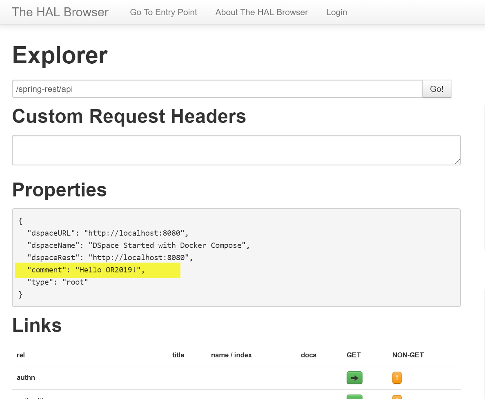


# Exercise 4: Running DSpace 7 with Docker-Compose

- Running DSpace 7
- Running DSpace 7 with entities

### Start DSpace 7

```shell
docker-compose -p d7 -f docker-compose.yml -f d7.override.yml pull
docker-compose -p d7 -f docker-compose.yml -f d7.override.yml up -d
```

Verify that DSpace is Running
```shell
docker ps
```

It will take 3-5 minutes for the services to start completely.  

You can track the startup with the following command.  Hit __Ctrl-C__ to exit the log output.

```
docker logs -f dspace
```

Once the services have started, you can view them on the web.
The first time you start DSpace, it will load some default AIP content.  This process takes an additional 3-5 minutes.
- [REST API: http://localhost:8080/spring-rest](http://localhost:8080/spring-rest)
- [Angular UI: http://localhost:3000](http://localhost:3000)

Explore the HAL Browser and the Angular UI.

```shell
docker-compose -p d7 -f docker-compose.yml -f d7.override.yml down
```

### Start the DSpace 7 Preview Release with the Entities Dataset

Note that we will create a separate set of DSpace 7 entities (-p d7ent) for this step.

```shell
docker-compose -p d7ent -f docker-compose.yml -f d7.override.yml -f d7.preview.yml pull
docker-compose -p d7ent -f docker-compose.yml -f d7.override.yml -f d7.preview.yml -f load.entities.yml up -d
```

Verify that DSpace is Running
```shell
docker ps
```

You can track the startup with the following command.  Hit __Ctrl-C__ to exit the log output.

```
docker logs -f dspace
```

It will take 3-5 minutes for the services to start completely.  Once they have started, you can view them on the web.
The first time you start DSpace, it will load some default AIP content.  This process takes an additional 3-5 minutes.
- [REST API: http://localhost:8080/spring-rest](http://localhost:8080/spring-rest)
- [Angular UI: http://localhost:3000](http://localhost:3000)

Explore the HAL Browser and the Angular UI.  See [Testing Entities Data](../run.DSpace7Entities.html#testing-the-entities-functionality) for additional testing notes.

Shutdown DSpace 7.

```shell
docker-compose -p d7ent -f docker-compose.yml -f d7.override.yml -f d7.preview.yml -f load.entities.yml down
```

### Run DSpace 7 with a modified (published image)

For this test, we are going to use a tagged version of the DSpace image.  
- Open [https://hub.docker.com/r/dspace/dspace/tags](https://hub.docker.com/r/dspace/dspace/tags) to explore the available images
  - Look for __or2019-workshop-7x__
  - [Pull Request Used to Create This Image](https://github.com/DSpace/DSpace/pull/2436/files)

Set the variable DSPACE_VER to select a different image.

```shell
DSPACE_VER=or2019-workshop-7x docker-compose -p d7 -f docker-compose.yml -f d7.override.yml config | grep image:
```

Run the following commands to start DSpace with this image.

```shell
DSPACE_VER=or2019-workshop-7x docker-compose -p d7 -f docker-compose.yml -f d7.override.yml pull
DSPACE_VER=or2019-workshop-7x docker-compose -p d7 -f docker-compose.yml -f d7.override.yml up -d
```

Open [the REST HAL Browser](http://localhost:8080/spring-rest) and notice the change listed in the Properties Section.



### Override Angular Image

Shutdown your running copy of DSpace
```shell
docker-compose -p d7 -f docker-compose.yml -f d7.override.yml down
```

For this test, we are going to use a tagged version of the DSpace image.  
- Open [https://hub.docker.com/r/dspace/dspace-angular/tags](https://hub.docker.com/r/dspace/dspace-angular/tags) to explore the available images
  - Look for __or2019-workshop-7x__
  - [Pull Request Used to Create This Image](https://github.com/DSpace/dspace-angular/pull/406/files)

Set the variable ANGULAR_VER to select a different image.

```shell
ANGULAR_VER=or2019-workshop-7x docker-compose -p d7 -f docker-compose.yml -f d7.override.yml config | grep image:
```

Run the following commands to start DSpace with this image.

```shell
ANGULAR_VER=or2019-workshop-7x docker-compose -p d7 -f docker-compose.yml -f d7.override.yml pull
ANGULAR_VER=or2019-workshop-7x docker-compose -p d7 -f docker-compose.yml -f d7.override.yml up -d
```

Open [the Angular UI](http://localhost:3000) and notice the change in the text color.
